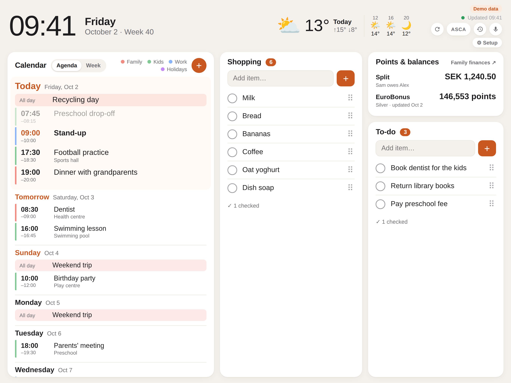

# Family dashboard

An always-on kitchen dashboard for an iPad: the family's week from Google Calendar, the weather, shared Google Keep lists you can tick off and reorder, and a voice assistant you talk to in Swedish. "ASCA, lägg till mjölk i inköpslistan" adds milk to the shopping list, and it answers back.

<picture>
  <source media="(prefers-color-scheme: dark)" srcset="docs/screenshot-dark.png">
  
</picture>

- **Calendar:** today and the next six days from the calendars you choose, colour-coded, with the ISO week number. Switch between **Agenda** (a list per day) and **Week** (seven columns on a time grid that zooms to the hours the week's events cover). Tap **+** to add an event; the toast has an **Undo**.
- **Lists:** Google Keep notes shared with your family. Tick items off, add new ones, or drag them into a new order. Changes reach Keep on your phones within seconds.
- **Voice:** tap the mic, or switch on hands-free and start with the wake word. It adds list items, calendar events and shared expenses, shows the weather, answers questions ("hur gör man pannkakor?") in a card, and reads its answer aloud. "Ångra" undoes the last command, and a log shows the last 50.
- **Weather** in the header, and **points & balances**: EuroBonus points from SAS's emails, and who owes whom in Split, a companion cost-sharing app (optional).
- Follows the iPad's light/dark setting and language (English or Swedish), keeps the screen awake, and signs family members in with Google.

It's a small Python app ([FastAPI](https://fastapi.tiangolo.com)) with a plain HTML/JS front end and no build step. It runs free on Vercel + Supabase or in Docker at home. Everything specific to a family is configuration, so a fork only needs its own accounts and keys; see [Set it up for your family](#set-it-up-for-your-family).

The code was written with [Claude Code](https://claude.com/claude-code).

## Services

| Service | What it does here | Cost |
| --- | --- | --- |
| [Vercel](https://vercel.com) | Runs the app (Python functions in Stockholm) and serves the page; deploys every push to `main` | Free (Hobby) |
| [Supabase](https://supabase.com) | Postgres for the little state there is: the Google refresh token, who may sign in, hidden Keep notes, the voice log | Free |
| Google Cloud: OAuth | "Sign in with Google" for family members, plus access to Calendar (read and add events) and Gmail (read, for EuroBonus only) | Free |
| Google Keep | The shared lists, through the unofficial [gkeepapi](https://github.com/kiwiz/gkeepapi) client and a master token | Free |
| [Anthropic Claude API](https://platform.claude.com) | Voice commands: turns a spoken sentence into actions with Claude Haiku 4.5 | Pay per use, about $0.002 a command |
| Safari (iPad) | Speech recognition and reading answers aloud, built into the browser | Free |
| [Open-Meteo](https://open-meteo.com) | The weather forecast; no key needed | Free |
| A domain registrar, e.g. Namecheap | Optional own address like `family.example.com`: one DNS record pointing at Vercel | A domain |

Docker at home can replace Vercel and Supabase; everything else stays the same.

## Set it up for your family

You need a Google account (the one with the family's calendars), and optionally a Supabase project (free), a Vercel account (free) and an Anthropic API key for voice. In order:

1. **Try it:** run it locally with `DEMO_MODE=true` (see [Development](#development)); no accounts needed.
2. **Deploy:** fork this repo, then follow [Deploy on Vercel + Supabase](#deploy-on-vercel--supabase) or [Run with Docker at home](#run-with-docker-at-home).
3. **Google:** create an OAuth client for sign-in, Calendar and Gmail ([step 1](#1-google-calendar-and-gmail)).
4. **Keep lists:** get a Keep master token ([step 2](#2-google-keep)).
5. **Voice (optional):** add an Anthropic API key ([Voice commands](#voice-commands)).
6. **The iPad:** add it to the Home Screen and keep it awake ([step 3](#3-the-ipad)).

Every setting is listed under [Configuration](#configuration) and in [`.env.example`](.env.example).

## How it works

```
iPad (Safari, added to Home Screen)
        │
        ▼
FastAPI app (this repo) ──► Google Calendar + Gmail   official API (Gmail only for EuroBonus)
        │               ├─► Google Keep               unofficial gkeepapi client
        │               └─► Claude API                voice commands (optional)
        ▼
Supabase table or local folder: Google refresh token, members, hidden Keep notes, voice log
```

A small Python app (FastAPI) holds the Google credentials and makes the API calls. The iPad only displays a web page, so no secrets live on it. Run the app in one of two ways:

- **Vercel + Supabase:** nothing to keep running at home. Vercel runs the app and serves the page; Supabase stores the tokens.
- **Docker at home:** a Raspberry Pi, a NAS or any always-on computer. Tokens are stored in a local folder.

## Deploy on Vercel + Supabase

1. **Supabase.** Create a project, or use one you already own; the dashboard only adds one table. The region *Stockholm (eu-north-1)* sits next to the Vercel function.
   - In **SQL Editor**, run the two files in [`supabase/migrations/`](supabase/migrations/) (`dashboard_kv` for tokens, `dashboard_members` for who can sign in). With the Supabase CLI, `supabase link` and `supabase db push` does the same.
   - Under **Project Settings → API Keys**, copy the project URL and a **secret key** (`sb_secret_…`). The legacy `service_role` key also works.
2. **Vercel.** Fork this repo on GitHub. In Vercel, choose **Add New → Project** and import your fork. Vercel detects FastAPI from `index.py`, so no build settings are needed. Add these **environment variables**:
   - `SUPABASE_URL` and `SUPABASE_SECRET_KEY` from step 1.
   - `GOOGLE_CLIENT_ID` and `GOOGLE_CLIENT_SECRET` (section 1 below).
   - `DASHBOARD_ADMINS`: your Google account email. Everyone signs in with Google, and only listed people get in. Add more people in the `dashboard_members` table (below) or here.
3. **Domain (recommended).** Under **Settings → Domains**, add a subdomain of a domain you own, e.g. `family.example.com`. Vercel then shows the DNS record to create; add it at your registrar (at Namecheap: **Domain List → Manage → Advanced DNS**, usually a `CNAME` for `family` pointing at the target Vercel gives). If your Google OAuth client already signs people in on that domain, it's already an authorized domain there.
4. **Deploy**, then open `/setup`. After changing environment variables, redeploy (**Deployments → ⋯ → Redeploy**); changes only apply to new deployments.

The dashboard refuses to serve anything on Vercel until sign-in is configured.

### Who can sign in

People sign in with their Google account. `DASHBOARD_ADMINS` are always admins. Everyone else lives in the `dashboard_members` table, where role `admin` can also open `/setup` and connect Google, and role `member` sees only the dashboard:

```sql
insert into public.dashboard_members (email, role) values ('someone@gmail.com', 'admin');
delete from public.dashboard_members where email = 'someone@gmail.com';
```

Changes apply within a minute, including removals. A session lasts 400 days and renews while the device is in use, so the kitchen iPad stays signed in.

Good to know:
- `vercel.json` runs the function in Stockholm (`arn1`). If your Supabase project is in another region, change it to the nearest one.
- The Google redirect URI defaults to `https://<production domain>/auth/google/callback`. `/setup` shows the exact value to register.
- Supabase's free plan pauses a project after about a week with no activity. Normal use reads and writes it, but if the iPad is off for weeks you may need to resume the project in the Supabase dashboard.
- Google may be warier of Keep sign-ins from a cloud data centre than from your home connection. If the list panels show sign-in errors on Vercel but the same token works locally, that's the likely cause.

## Run with Docker at home

```sh
cp .env.example .env          # fill it in; DEMO_MODE=true for a first look
docker compose up -d --build
```

Open `http://<server-ip>:8080`. Give the server a fixed IP in your router. Tokens go in the `dashboard-data` Docker volume; Supabase isn't needed.

Without Docker (Python 3.11+):

```sh
python3 -m venv .venv && . .venv/bin/activate
pip install -r requirements.txt
uvicorn app.main:app --host 0.0.0.0 --port 8080 --env-file .env
```

## 1. Google Calendar and Gmail

You create your own (free) Google Cloud OAuth client once:

1. Go to <https://console.cloud.google.com> and create a project, or reuse one that already has an OAuth client (e.g. the one behind your website's "Sign in with Google"). The same client handles both signing in to the dashboard and reading Calendar + Gmail.
2. **APIs & Services → Library:** enable **Google Calendar API** and **Gmail API**.
3. **Google Auth Platform:**
   - *Branding:* app name "Family dashboard", your email.
   - *Audience:* User type **External**.
   - *Data access:* add the scopes `.../auth/calendar.readonly`, `.../auth/calendar.events` and `.../auth/gmail.readonly`. (`calendar.events` lets the iPad add events; `calendar.readonly` is still needed to list your calendars.)
   - *Audience → Publish app* so it's **In production**. While the app is in *Testing*, Google expires the sign-in after 7 days and the dashboard would need reconnecting every week. Personal use doesn't need Google's verification. You'll just see an "unverified app" warning when connecting; choose *Advanced → Go to Family dashboard*.
   - *Clients → Create client → Web application.* Under **Authorized redirect URIs**, add the address `/setup` shows:
     - On Vercel: `https://<your-project>.vercel.app/auth/google/callback`
     - With Docker at home: `http://localhost:8080/auth/google/callback`
4. Set `GOOGLE_CLIENT_ID` and `GOOGLE_CLIENT_SECRET` in Vercel's environment variables or in `.env`. Remove `DEMO_MODE`, then redeploy or restart.
5. Open `/setup` and click **Connect Google account**. Approve every permission.
   - Docker only: if the server isn't the computer you're using, Google sends you to a `localhost` page that won't load. That's expected. Copy the whole address from the address bar and paste it into the box on `/setup`.

The dashboard reads your calendars and can add events. It reads Gmail only to find the EuroBonus balance in SAS's emails; no mail is shown on the dashboard. It only ever deletes events it created itself (the Undo button); it can't touch your other events. If you connected before adding events was possible, `/setup` asks you to reconnect once.

### Choosing calendars

`/setup` lists all your calendars. By default the dashboard shows the calendars that are ticked in Google Calendar. To choose them yourself, set `CALENDARS` to a comma-separated list of calendar names (or IDs). Add `=Short name` to rename one in the legend:

```
CALENDARS=Family,Kids' school=School,Holidays in Sweden=Holidays
```

## 2. Google Keep

Google has no Keep API for personal Gmail accounts; the official one is only for Workspace organisations. So the dashboard uses [gkeepapi](https://github.com/kiwiz/gkeepapi), which signs in the way the Keep Android app does, using a **master token**. It works well, but it's unofficial and Google could break it. If that happens, the list panels show the error and the rest of the dashboard keeps working.

**Which notes show up** (`KEEP_LISTS`):
- `family` (default): notes shared with your Google family group. In Keep, open a note → collaborator icon → share with your family group. Checklists can be ticked off and added to; text notes are shown read-only.
- `shared`: notes shared with anyone.
- Otherwise a comma-separated list of note titles, e.g. `Shopping,To-do`. Matching ignores case and punctuation.

At most four notes are shown, pinned ones first, then the most recently edited. In `family` and `shared` mode, `/setup` lists the notes that qualify, with a tick box each: untick a note to hide it from the dashboard. New family notes show up until you hide them. Private notes are never listed, not even on `/setup`. Nothing from Keep is stored apart from the ids of hidden notes: notes are fetched into memory when needed.

A master token gives full access to the Google account it belongs to. It lives only in the server's environment variables; changing the account's password revokes it. For extra isolation you can use a separate Google account that the family notes are shared with instead of your own.

Get the token:

1. In a desktop browser (a private window is easiest), open <https://accounts.google.com/EmbeddedSetup> and sign in with the account. Accept the terms. The page may keep spinning afterwards; that's fine.
2. Open the developer tools: **Application** (Chrome) or **Storage** (Firefox/Safari) → **Cookies** → `accounts.google.com`. Copy the value of `oauth_token` (it starts with `oauth2_4/`).
3. Within a few minutes (the cookie expires quickly and works once), run:

   ```sh
   python3 -m venv /tmp/keep && /tmp/keep/bin/pip install -q gpsoauth
   /tmp/keep/bin/python scripts/keep_master_token.py
   # or, with the Docker setup:  docker compose run --rm dashboard python scripts/keep_master_token.py
   ```

   Enter the email and paste the cookie value. The script prints `KEEP_EMAIL` and `KEEP_MASTER_TOKEN`.
4. Set those two variables (and `KEEP_LISTS` if you don't want the default `family`). Redeploy or restart.

## 3. The iPad

1. In Safari, open the dashboard and sign in with Google (or enter the access key on a Docker install).
2. **Share → Add to Home Screen**, then open the dashboard from the Home Screen so it runs full screen. The Home Screen app has its own storage, so sign in once more there.
3. **Settings → Display & Brightness:** Auto-Lock **Never**. Appearance **Automatic** gives a dark dashboard in the evening.
4. Optional: **Settings → Accessibility → Guided Access.** Triple-click the top (or home) button while the dashboard is open to lock the iPad to it.
5. It stays plugged in, so turn on **Settings → Battery → Charging → 80% Limit** if your iPad has it.

Tap **↻** (top right) to reload everything, including a new version after you deploy. Tapping the clock refreshes the data without reloading.

## Configuration

All settings are environment variables: Vercel's project settings, or `.env` with Docker. `.env.example` has comments for each.

| Variable | Default | |
| --- | --- | --- |
| `DASHBOARD_ADMINS` | *(none)* | Google accounts that can always sign in as admin. |
| `SESSION_SECRET` | derived from the Google client secret | Signs session cookies. |
| `DASHBOARD_ACCESS_KEY` | *(none)* | Optional shared admin password, for installs without Google sign-in. |
| `DASHBOARD_TITLE` | *(none)* | Shown top right, e.g. "The Smiths". |
| `DASHBOARD_LANGUAGE` | iPad's language | `en` or `sv`. |
| `DEMO_MODE` | `false` | Sample data, no accounts needed. |
| `SUPABASE_URL` / `SUPABASE_SECRET_KEY` | | Store tokens in Supabase instead of a local folder. Required on Vercel. |
| `GOOGLE_CLIENT_ID` / `GOOGLE_CLIENT_SECRET` | | From the OAuth client (step 1). |
| `GOOGLE_REDIRECT_URI` | Vercel production domain, else `http://localhost:8080/auth/google/callback` | Must be listed on the OAuth client. |
| `GOOGLE_REFRESH_TOKEN` | | Overrides the stored token. |
| `CALENDARS` | calendars ticked in Google | Names or IDs, comma-separated; `Name=Short name` renames. |
| `KEEP_EMAIL` / `KEEP_MASTER_TOKEN` | | From step 2. |
| `KEEP_LISTS` | `family` | `family`, `shared`, or note titles, comma-separated. |
| `WEATHER_LAT` / `WEATHER_LON` / `WEATHER_PLACE` | *(off)* | Weather in the header (Open-Meteo, no key). From 20:00 it shows tomorrow. |
| `ANTHROPIC_API_KEY` | *(off)* | Turns on voice commands (below). A key from platform.claude.com. |
| `ASSISTANT_NAME` | `ASCA` | The wake word. |
| `ASSISTANT_ALIASES` | ASCA's usual mishearings | How speech recognition mishears the wake word, comma-separated. |
| `SPLIT_PEOPLE` | *(off)* | Split's two people, `id=Name,id=Name`, first person first (see Split below). |
| `SPLIT_RATIO_COLUMN` | `first_ratio_ppm` | The column in Split's `split_entries` that holds the first person's share. |
| `FINANCES_URL` | *(off)* | A "Family finances" link in the balances panel. |
| `SHOW_EUROBONUS` | `true` | EuroBonus points and tier, read from SAS's emails in the connected Gmail. |
| `DATA_DIR` | `data` (`/data` volume in Docker) | Token folder when Supabase isn't set. |

## Voice commands

With `ANTHROPIC_API_KEY` set, the header gets a microphone and a wake-word switch labelled with `ASSISTANT_NAME` (default **ASCA**). Get the key at [platform.claude.com](https://platform.claude.com); API use is billed separately from a Claude subscription, and each command costs a fraction of a cent.

- **Mic:** tap it and say the command.
- **Wake word:** hands-free while the screen is on. Start a sentence with "ASCA", or say "ASCA", wait for the bubble, then the command. Each iPad remembers the switch.

What it understands (Swedish first, English works too):

| Say | It does |
| --- | --- |
| "ASCA, lägg till mjölk och kaffe i inköpslistan" | Adds both to the Keep list whose name fits best |
| "ASCA, lägg till konferens 3–4 november i kalendern" | Adds an all-day event (or a timed one: "på fredag klockan 18") |
| "ASCA, Alex betalade elräkningen 1 200" | Logs an expense in Split (only with `SPLIT_PEOPLE`) |
| "ASCA, hur är vädret imorgon?" | Shows the forecast in a card and reads it aloud |
| "ASCA, recept på kyckling och ris i ugn" | A short answer in a card, a summary read aloud |
| "ASCA, ångra" | Undoes the last command that added something |

It answers aloud in Swedish ("Visst! Mjölk och kaffe är tillagda i Inköp."), and the toast has an **Undo**. The clock button next to the mic shows the last 50 commands, each with **Undo**; the log is kept in the store (`voice_log`), so every device shares it. Answers come from Claude's own knowledge; it doesn't search the web.

How it works: Safari's speech recognition (`sv-SE`) turns speech into text on the iPad. `POST /api/assistant` sends that sentence, today's date and the names of the shown lists and writable calendars to Claude (`claude-haiku-4-5`, the cheapest model), which answers with tool calls. The server checks them and runs them with the same code as the dashboard's buttons. "Ångra" and similar phrases are handled without Claude. Nothing else is sent to Anthropic.

Speech recognition runs in Safari. It needs Dictation switched on in iPadOS settings, and it can be unreliable in a Home Screen web app; if the mic stays on "Listening…", the reason is sent to the server log.

## Split (optional)

Split is a separate little app of ours for two people who share costs in proportion to their incomes. It isn't part of this repo, but the dashboard can show its balance and add expenses by voice when Split's tables (`split_incomes`, `split_entries`) are in the same Supabase project. Set `SPLIT_PEOPLE` to its two person ids and names, e.g. `SPLIT_PEOPLE=alex=Alex,sam=Sam`, `SPLIT_RATIO_COLUMN` to the column holding the first person's share, and `FINANCES_URL` to its address for a link in the balances panel. Without them, both stay off.

## Security

- Only signed-in members (or holders of the access key) get any data. The page itself is just an empty shell. On Vercel the app refuses to serve data until sign-in is configured. A Docker install with neither Google sign-in nor an access key is open to its local network.
- Sessions are HMAC-signed, HttpOnly, `Secure` behind HTTPS and `SameSite=Lax`. Removing someone from `dashboard_members` locks them out within a minute.
- Only expose a Docker install to the internet over HTTPS.
- The Supabase tables have row level security with no policies, so only the secret key can read them. That also holds when they share a project with another app whose public (anon) key is in a browser. Keep the secret key out of anything client-side.
- `.env` and the data folder hold secrets and are git-ignored. Local token files are written with mode `600`.
- No mail is shown, because anyone in the kitchen can read the screen. Gmail is only searched for SAS's EuroBonus emails.

## Development

```sh
pip install -r requirements-dev.txt
pytest
DEMO_MODE=true uvicorn app.main:app --reload --port 8080
```

```
index.py          Vercel entrypoint (re-exports app.main:app)
app/
  main.py         routes, access key, /setup page
  config.py       settings from environment variables
  auth.py         Google sign-in sessions and who is a member/admin
  store.py        token storage: Supabase table or local folder
  google_auth.py  OAuth consent + stored refresh token
  gcal.py         Google Calendar
  gkeep.py        Google Keep via gkeepapi
  weather.py      weather from Open-Meteo
  accounts.py     EuroBonus (from Gmail)
  assistant.py    voice commands: a sentence becomes checked actions, via Claude
  voicelog.py     the log of voice commands, and undo
  cache.py        a small in-memory cache
  demo.py         sample data for DEMO_MODE
public/           the dashboard page (plain HTML/CSS/JS, no build step)
supabase/         migration for the storage table
scripts/          keep_master_token.py
tests/
```

## License

MIT, see [LICENSE](LICENSE).
